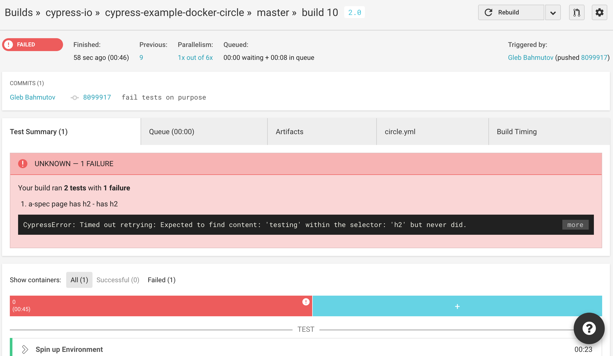
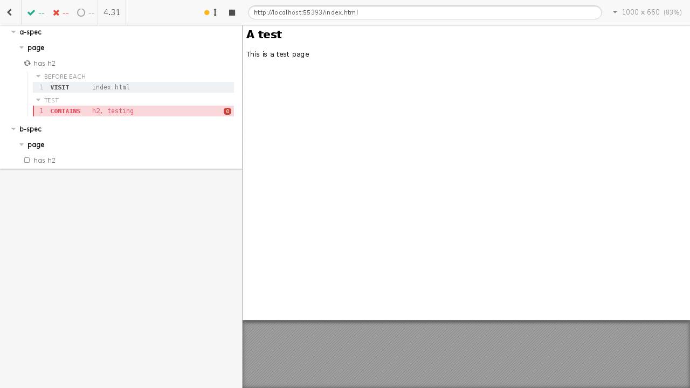

# cypress-example-docker-circle [](https://circleci.com/gh/cypress-io/cypress-example-docker-circle)

> Cypress + Docker + CircleCI = ❤️

Running your Cypress E2E tests on Circle CI v2.0 is very simple.
See [circle.yml](circle.yml) for the current build commands.
In general, you can either start with a base image
[cypress/base](https://hub.docker.com/r/cypress/base/)
or with an image that already includes Cypress tool
[cypress/internal](https://hub.docker.com/r/cypress/internal/).

Then check out the code and call `cypress run` command. That is it!
See test runs for this example at
[circleci.com](https://circleci.com/gh/cypress-io/cypress-example-docker-circle)


**Note:** if you want to use CircleCI [Workflows feature][workflows] to run
multiple tests in parallel, check out our example repo
[cypress-example-docker-circle-workflows][workflows-repo].

[workflows]: https://circleci.com/docs/2.0/workflows/
[workflows-repo]: https://github.com/cypress-io/cypress-example-docker-circle-workflows

## Artifacts

You can save generated videos and screenshots as CircleCI artifacts

```yaml
steps:
  - checkout
  - run:
      name: Running E2E tests
      command: cypress run
  - store_artifacts:
      path: cypress/videos
  - store_artifacts:
      path: cypress/screenshots
```

## Test summary

### Generate just XML report

CircleCI can [store test results](https://circleci.com/docs/2.0/configuration-reference/#store_test_results)
from a large number of [test reporters](https://circleci.com/docs/1.0/test-metadata/#metadata-collection-in-custom-test-steps).
Cypress can [output test results](https://on.cypress.io/reporters)
with custom reporters, including using built-in `junit` format.
Just add the following options to the CI command to generate and store test
results.

```yaml
- run:
    name: Running E2E tests
    command: cypress run --reporter junit --reporter-options "mochaFile=results/my-test-output.xml"
- store_test_results:
    path: results
```

The generated file will be placed in folder `results` and the folder will be
uploaded to CircleCI storage. This summary will be really helpful when a test
fails. For example, I have introduced a different label into the test, the
word `testing` never appears on the page, yet the test is looking for it.

```js
// a-spec.js
it('has h2', () => {
  cy.contains('h2', 'testing')
})
```

See the failed CI test run at
[https://circleci.com/gh/cypress-io/cypress-example-docker-circle/10](https://circleci.com/gh/cypress-io/cypress-example-docker-circle/10).

The CircleCI test summary shows failed test and user-friendly message.



Switching to the artifacts tab, we can find the screenshot PNG image taken
at the failure moment.


Finally, we can open either the video, or the screenshot artifact



The failure is now easy to see and fix.

In this repository take a look at `test-junit` script inside [package.json](package.json)

### Spec + XML reports

You can generate XML `junit` report and see spec output while CI is running
using [mocha-multi-reporters](https://github.com/stanleyhlng/mocha-multi-reporters).

```text
npm install --save-dev mocha mocha-multi-reporters mocha-junit-reporter
cypress run --reporter mocha-multi-reporters --reporter-options configFile=config.json
```

File [config.json](config.json) has

```json
{
  "reporterEnabled": "spec, mocha-junit-reporter",
  "mochaJunitReporterReporterOptions": {
    "mochaFile": "multiple-results/results.xml"
  }
}
```

The standard output will have spec names during the test run, and the final result will be
saved in JUnit XML format in file `multiple-results/results.xml`.

Take a look at `test-multiple` script inside [package.json](package.json) for example.

## Happy testing

If you find problems with Cypress and CI, please

- consult the [documentation](https://on.cypress.io)
- ask in our [Gitter channel](https://gitter.im/cypress-io/cypress)
- find an existing [issue](https://github.com/cypress-io/cypress/issues)
  or open a new one
